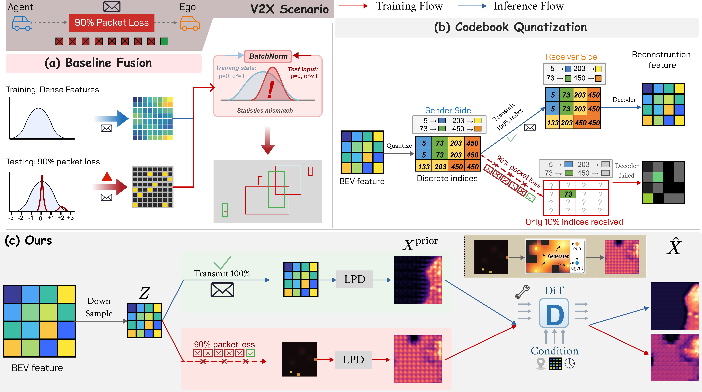
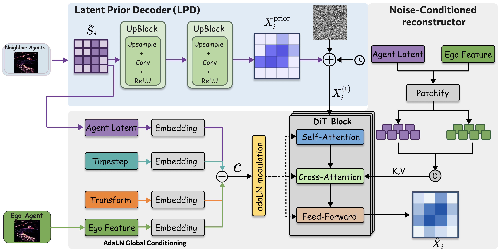
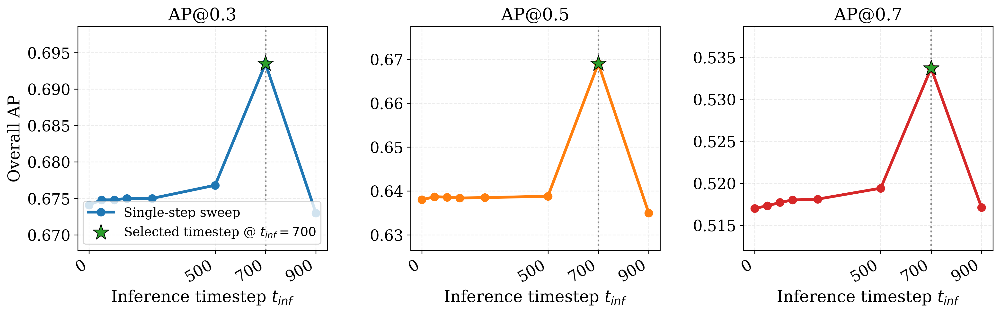
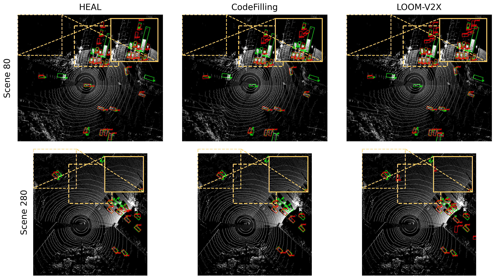

<div align="center">

# LR-V2X: Loss-Resilient Collaborative Perception<br>under Low-Bandwidth Communication

[](https://arxiv.org)
[](https://www.python.org/downloads/release/python-380/)
[](https://pytorch.org/)
[](LICENSE)

</div>

---

<p align="center">
  
</p>

<p align="center">
  <i>LR-V2X delivers reliable collaborative perception under stochastic packet loss at only 128 KB per agent,
  outperforming dense-BEV baselines that transmit 64× more data.</i>
</p>

---

## Overview

**LR-V2X** addresses a practical challenge in V2X collaborative perception: what happens when spatial feature packets are randomly dropped over a low-bandwidth channel?  

When received BEV feature maps contain large spatial holes, LR-V2X recovers missing content via **two complementary stages**:

1. **Latent Prior Decoder (LPD)**: Overlapping transposed convolutions extrapolate received spatial locations into a spatially complete prior BEV map — no retraining required per packet-loss rate.
2. **Noise-Conditioned Reconstructor (NCR)**: A DiT-based denoiser refines the LPD prior, jointly conditioned on the received latent and the ego agent's own BEV context, using a diffusion-style training strategy that generalizes to unseen packet-loss rates at test time.

<p align="center">
  
</p>
<p align="center"><i>LR-V2X pipeline: the LPD produces an initial prior BEV map; the NCR (DiT) iteratively refines it guided by the ego context and received latents.</i></p>

---

## Results

### Detection AP vs. Packet-Loss Rate

<p align="center">
  
</p>

LR-V2X achieves the strongest mAP on both **DAIR-V2X** and **V2XREAL** at up to 90% packet loss, while transmitting only 128 KB per collaborator (8× compression).

### Qualitative Comparison (DAIR-V2X, 90% Packet Loss)

<p align="center">
  
</p>

---

## Installation

### Step 1: Conda Environment

```bash
conda create -n lrv2x python=3.8 pytorch==1.12.0 torchvision==0.13.0 cudatoolkit=11.6 \
    -c pytorch -c conda-forge
conda activate lrv2x
pip install -r requirements.txt
python setup.py develop
```

### Step 2: Spconv 2.x

Choose the version matching your CUDA (see [spconv releases](https://github.com/traveller59/spconv)):

```bash
pip install spconv-cu116   # CUDA 11.6 example
```

### Step 3: Compile IoU Extension

```bash
python opencood/utils/setup.py build_ext --inplace
```

---

## Data Preparation

**V2XREAL** — Download from the [V2X-Real website](https://mobility-lab.seas.ucla.edu/v2x-real/). Organize as:

```
v2xreal/
├── train/
├── validate/
└── test/
```

**DAIR-V2X-C** — Download from [DAIR-V2X](https://thudair.baai.ac.cn/index). Use the complemented annotations following [this guide](https://siheng-chen.github.io/dataset/dair-v2x-c-complemented/).

Update `root_dir`, `validate_dir`, and `test_dir` in the YAML configs under `opencood/hypes_yaml/`.

---

## Training

LR-V2X uses a **three-stage** training procedure:

### Stage 1 — Backbone pre-training

```bash
python opencood/tools/diffv2x_stages/train_diffv2x_stage1.py \
    --hypes_yaml opencood/hypes_yaml/v2x_real/DiffV2X_Stages/v2x_real_stage1_pyramid_Baseline.yaml \
    --model_dir logs/lrv2x_stage1
```

### Stage 2 — LPD + NCR training (backbone frozen)

```bash
python opencood/tools/diffv2x_stages/train_diffv2x_stage2.py \
    --hypes_yaml opencood/hypes_yaml/v2x_real/DiffV2X_Stages/v2x_real_diffv2x_stage2_latent_prior_8x.yaml \
    --stage1_model logs/lrv2x_stage1/net_epoch_bestval_at<N>.pth \
    --model_dir logs/lrv2x_stage2
```

### Stage 3 — End-to-end fine-tuning

```bash
python opencood/tools/diffv2x_stages/train_diffv2x_stage3.py \
    --hypes_yaml opencood/hypes_yaml/v2x_real/DiffV2X_Stages/v2x_real_diffv2x_stage3_latent_prior_finetune_8x.yaml \
    --stage2_model logs/lrv2x_stage2/net_epoch_bestval_at<N>.pth \
    --model_dir logs/lrv2x_stage3
```

**Multi-GPU training** (e.g., 4 GPUs):

```bash
CUDA_VISIBLE_DEVICES=0,1,2,3 python -m torch.distributed.launch \
    --nproc_per_node=4 --use_env \
    opencood/tools/diffv2x_stages/train_diffv2x_stage2.py \
    --hypes_yaml opencood/hypes_yaml/v2x_real/DiffV2X_Stages/v2x_real_diffv2x_stage2_latent_prior_8x.yaml \
    --stage1_model logs/lrv2x_stage1/net_epoch_bestval_at<N>.pth \
    --model_dir logs/lrv2x_stage2
```

Configs for **4×, 8×, and 16× compression** on both V2XREAL and DAIR-V2X are under `opencood/hypes_yaml/`.

---

## Evaluation

Evaluate under stochastic packet loss (sweeps 0% → 90%):

```bash
python opencood/tools/inference_pkloss_mc.py \
    --model_dir logs/lrv2x_stage3
```

---

## Key Source Files

| File | Description |
|---|---|
| `opencood/models/diffv2x_pyramid_mc.py` | Main LR-V2X model |
| `opencood/models/sub_modules/simple_prior_decoder.py` | Latent Prior Decoder (LPD) |
| `opencood/models/sub_modules/diffusion_model_dit.py` | DiT Noise-Conditioned Reconstructor (NCR) |
| `opencood/models/sub_modules/latent_encoder.py` | Latent encoder |
| `opencood/models/sub_modules/diffusion_sampler.py` | Diffusion forward/reverse schedule |
| `opencood/utils/packet_loss_utils.py` | Spatial packet-loss mask generation |

---

## Citation

If you find this work useful, please cite:

```bibtex
@article{lrv2x2026,
  title   = {LR-V2X: Loss-Resilient Collaborative Perception under Low-Bandwidth Communication},
  author  = {Anonymous},
  journal = {arXiv preprint},
  year    = {2026}
}
```

*(arXiv link coming soon — citation will be updated.)*

---

## Acknowledgements

This codebase builds upon [HEAL](https://github.com/yifanlu0227/HEAL) and [V2X-Real](https://github.com/ucla-mobility/V2X-Real). We thank the authors for releasing their code.
